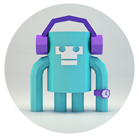
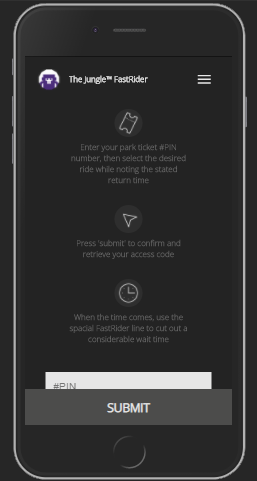
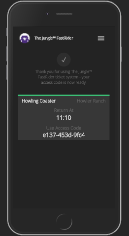
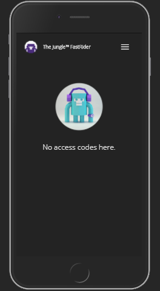
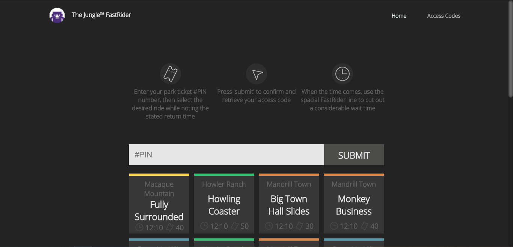
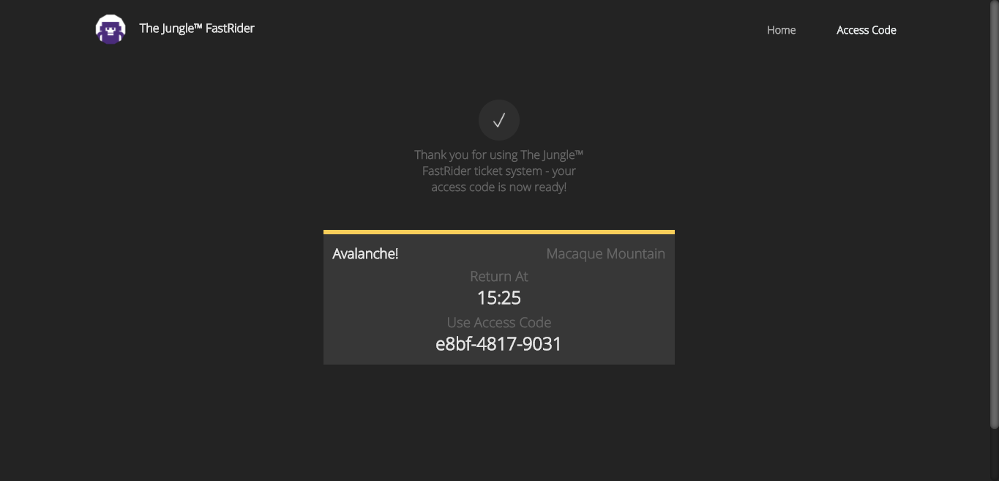

<!-- PROJECT LOGO -->
 

    

  <h3 align="center">Welcome to The Jungle™ FastRider App</h3>

  

     
     
    <!-- <a href="https://github.com/talsaharonline/Tal-Sahar-21-09-2020">View Demo</a> -->
  

<!-- TABLE OF CONTENTS -->

## Table of Contents

- [Project Overview](#overview)
- [Built With](#built-with)
- [Usage](#usage)
- [Additional Notes](#additional-notes)
- [Contact](#contact)

 

<!-- Project Overview -->

## Overview

    
    
    
    
    

 

## Built With

- [React](https://reactjs.org/)
- [React Hooks](https://reactjs.org/docs/hooks-intro.html)
- [React Redux](https://react-redux.js.org/introduction/quick-start#:~:text=React%20Redux%20is%20the%20official,the%20store%20to%20update%20data.)
- [React Router](https://reactrouter.com/)
- [React Toast Notifications](https://jossmac.github.io/react-toast-notifications/)
- [Axios](https://www.npmjs.com/package/axios)
- [SCSS](https://sass-lang.com/)
- [Material UI](https://material-ui.com/)
- [FlexBox](https://developer.mozilla.org/en-US/docs/Web/CSS/CSS_Flexible_Box_Layout/Basic_Concepts_of_Flexbox)
- [CSS Modules](https://create-react-app.dev/docs/adding-a-css-modules-stylesheet/)
- [Local Storage](https://developer.mozilla.org/en-US/docs/Web/API/Window/localStorage)

 

<!-- USAGE EXAMPLES -->

## Usage

This project generates and prints a new valid PIN code every time you refresh the home page,
which you can copy in the console inside your browser.

Each PIN key can provide a new access code only in the playground time frame,
which means you cannot get a second access code inside the playground time frame.

 

<!-- ADDITIONAL NOTES -->

## Additional Notes

- This project is fully responsive, including larger desktop screens and mobile devices.
- This project was deployed directly from github to Netlify.
- This project was built with Local Storage in order to have a better user experience when refreshing the browser (it saves your access code).

 

<!-- CONTACT -->

## Contact

Tal Sahar

Gmail - talsaharonline@gmail.com

Linkedin - https://www.linkedin.com/in/tal-sahar
